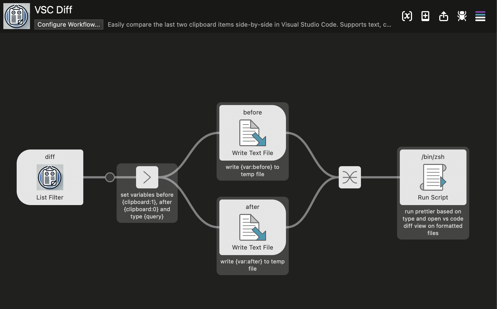

# VSC Diff

## Background
In my current role as a QA Engineer, I frequently need to compare different versions of JSON responses, code snippets, or configuration files during testing and debugging. The process often involved creating temporary files, formatting them, and manually opening them in a diff tool—a repetitive and time-consuming task. VSC Diff simplifies this process, making it effortless to compare clipboard items with just a few keystrokes. Whether you’re working with JSON APIs, debugging code, or comparing text, this workflow streamlines your workflow and saves valuable time.

## Overview
**VSC Diff** is an Alfred Workflow that enables you to quickly compare the last two clipboard items side-by-side in **Visual Studio Code**. It supports a wide range of file types, ensuring that your content is properly formatted and ready for comparison. With automatic formatting powered by **Prettier**, you get clean and consistent results every time.

## Features
- Compare the last two clipboard items effortlessly.
- Supports multiple file types:
  - **JavaScript**: `.js`
  - **JSX**: `.jsx`
  - **Vue**: `.vue`
  - **TypeScript**: `.ts`
  - **TypeScript (JSX)**: `.tsx`
  - **CSS**: `.css`
  - **LESS**: `.less`
  - **SCSS**: `.scss`
  - **HTML**: `.html`
  - **Ember**: `.hbs`
  - **JSON**: `.json`
  - **GraphQL**: `.graphql`
  - **Markdown**: `.md`
  - **YAML**: `.yaml`
  - **Text**: `.txt`
- Automatically formats files with **Prettier** before comparison.
- Opens the diff in **Visual Studio Code**.

## Workflow Preview

### Alfred Workflow Trigger
This is how the workflow looks in Alfred when you type `diff` and select the desired file type:


### Visual Studio Code Diff View
After selecting the file type, the diff opens in Visual Studio Code for easy side-by-side comparison:


### Workflow Structure
Here’s an overview of how the workflow is set up in Alfred:  



## Requirements
Before using the workflow, ensure the following are installed:
1. **Visual Studio Code**: [Download VS Code](https://code.visualstudio.com/)
2. **Prettier**: Install globally via npm:

   ```
   npm install -g prettier
   ```

## Installation
1. Download and import the workflow into Alfred.
2. Ensure the `prettier` and `code` commands are available in your terminal. Test with:

   ```
   prettier --version
   code --version
   ```

## Usage
1. Copy two items to your clipboard that you want to compare (e.g., code snippets, configuration files, or text).
2. Open Alfred and type the trigger keyword `diff`.
3. Select the file type that matches the clipboard content:
   - Options include JavaScript, TypeScript, JSON, HTML, YAML, Markdown, and more.
4. The workflow will:
   - Save the clipboard items as temporary files in a cache folder.
   - Format the files using **Prettier** for supported file types.
   - Open the files side-by-side in **Visual Studio Code** in diff mode.

## Benefits
- Saves time by automating file creation, formatting, and diffing.
- Provides a clean, formatted view for easier content comparison.
- Supports a wide range of text and code formats for maximum versatility.

## Troubleshooting
If the workflow doesn’t work as expected:
1. Verify that **Prettier** and **Visual Studio Code** are installed and accessible in your terminal.
2. Check that the `prettier` and `code` commands are included in your system's `$PATH`.
3. Ensure your Alfred Workflow is configured correctly and that clipboard permissions are granted.

## License
This workflow is released under the [MIT License](https://opensource.org/licenses/MIT).